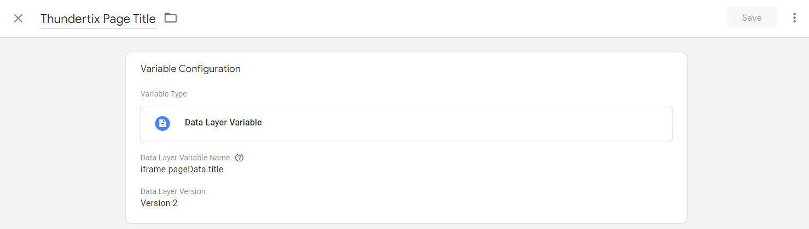
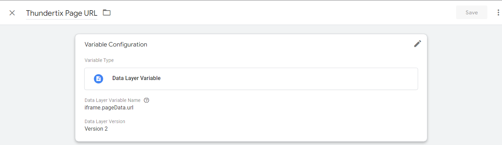
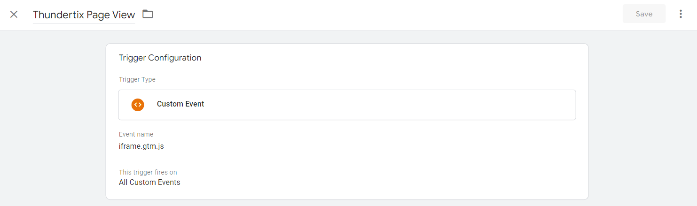
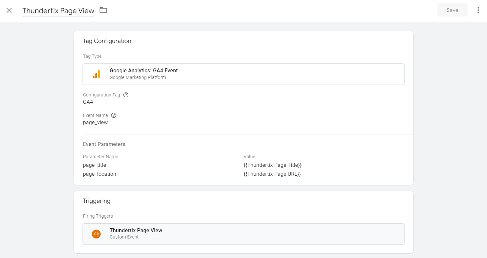

**08/10/2022: Updated with simplified approach**

# Thundertix GA4 Google Analytics Tracking
Thundertix is an event ticketing service. They promote easy Google Analytics integration as a feature, but in reality it's not so simple.

First, their built in integration only supports the older, soon to be discontinued "UA" version of Google Analytics. 

Second, their implementation only works when visitors purchase tickets directly from the Thundertix website. At least in most modern browsers, it won't work if you are selling tickets from your website by embedding their page in an iframe.

Finally, they don't support ecommerce in analytics, which is arguably the most important data.

This represents my attempt to work around those limitations and get Google Analytics 4 implemented and working, including ecommerce.

## Overview
The first hurdle is that for security reasons, browsers are blocking cookies from third party iframes. This blocking prevents analytics from working in some situations including embedded Thundertix ticketing iframe on your website.

A workaround was developed by Simo Ahava. Details of Simo Ahava's implementation can be found [here.](https://www.simoahava.com/analytics/cookieless-tracking-cross-site-iframes/) I have implementd his solution specifically to work through Tag Manager for Thundertix embeds.

Instead of reporting events directly to Google Analytics, the Thundertix events will be sent to your website which can then report it to Analytics.  

- Google Tag Manager triggers events on the embedded Thundertix page.
- A custom Google Tag Manager tag on the Thundrtix page sends a copy of each event to the parent window.
- A custom Google Tag Manager tag on the main window listens for these messages, records the events in the parent window.
- Custom Tag Manager GA4 events are triggered, sending the data to the parent window's Google Analytics account. 

This means the analytics from the Thundertix events will appear in your main site's analytics account. 

## Implementation
Note: this is just the basic implementation. Ecommerce is more complicated, and will be discussed later in this document. This section will set up communication between the Thundertix iframe and your website, and will allow tracking of page views. If desired, viewing the "Thank You" page can be set up as a GA4 conversion.

### Thundertix Child Frame Setup
#### Google Tag Manager
- Create a separate [Google Tag Manager](https://tagmanager.google.com/) account for use on Thundertix, if you don't already have one.
- Create a "Custom HTML Tag" in Tag Manager, using the script in the [child_frame.js file.](https://github.com/magicalbrad/thundertixGA4/blob/main/child_frame.js) It should be triggered on all pages. There are some optional configuration options in the file. See the comments in the file for more info. 

  
Example Image

  
  

#### Thundertix Admin
- In the "Integrations & Pixel Tracking" area of the Thundertix admin, add your Google Tag Manager account ID.

### Parent Window (a.k.a. your site where the Thundertix frame is used)
#### Google Tag Manager
- Create a [Google Tag Manager](https://tagmanager.google.com/) account and implement it on your site, if you don't already have it set up.
- Create a "Google Analytics: GA4 Configuration Tag" in Tag Manager, configured for your website's GA4 account, if you don't already have one set up.

  
Example Image

  
  

- Create a "Custom HTML Tag" in Tag Manager, using the script in [parent_frame.js file.](https://github.com/magicalbrad/thundertixGA4/blob/main/parent_frame.js) There is an optional configuration option in the file. See the comments in the file for more info. This tag only needs to be triggered on pages that have a Thundertix iframe.

  
Example Image

  
  

- Create the following Tag Manager Variables:

| Name | Variable Type | Variable Name |
|---|---|---|
| Thundertix Page Title  | Data Layer Variable | iframe.pageData.title |
| Thundertix Page URL  | Data Layer Variable | iframe.pageData.url |

  
Thundertix Page Title Example Image

  
  

  
Thundertix Page URL Example Image

  
  

- Create the following trigger:

| Name | Trigger Type | Event Name | Trigger Fires on |
|---|---|---|---|
| Thundertix Page View | Custom Event | iframe.gtm.js | All Custom Events |

  
Example Image

  
  

- Create the following tag:


| Name | Tag Type | Event Name | Event Parameters | Triggering |
|---|---|---|---|---|
| Thundertix Page View  | GA4 event | page_view | page_title: {{Thundertix Page Title}}  page_location: {{Thundertix Page URL}} | Thundertix Page View |



  
Example Image

  
  

#### Your Website
- Install Google Tag Manager on your website.

#### Notes and Additional Options
You can set up customers viewing the "Thank You" page to be a conversion in Analytics. You'd need to create a custom event in Analytics, named something like "thank_you_page_view." That event will use the following matching conditions:

- event_name equals page_view
- page_location contains thank_you

You'll then need to mark this new event as a conversion.

If you wish to track more events, you can manually add them to the data layer. You also could install GA4 on the Thundertix page through tag manager. All GA4 events would be pased up to your page. In either case, you'd also need to add tags in your main website's tag manager to monitor for those events and trigger the appropriate GA4 event on your site.

## Ecommerce Implementation

Thundertix doesn't support GA4 ecommerce. This is my attempt to make it work anyway. It scrapes the necessary data off the page, which is a fragile hack that will break if they make even minor changes to the ticketing pages. 

As your needs may be different than mine, you should probably consider this as an example reference implementation, rather than a plug-and-play solution. Also be aware it could stop working at any time. 

Here's my approach. I am considering the show name to be the item name, and the ticket type to be the item variant. I am ignoring the date. 

I am triggering a view_item event with a minimal ecommerce object with an item array containing just the show name displayed on that page. I am considering the page where ticket quantities are selected, "/orders/new?performance_id=XXXXXXXX," to be the "item page." This page has the ticket price which is required for the view_item event.  If there are multiple ticket types, the price of the first ticket displayed on the page is used for the event value.

The add_payment_info event is triggered on this same page when it is submitted. This creates a full ecommerce object based on what was in the cart at the time payment was attempted. I actually don't bother tracking this event, as I'm only triggering this to get the ecommerce object. 

A purchase event is triggered when the "Thank You" page is viewed. There isn't sufficient information on this page to create an ecommerce object. However, the ecommerce object created for the add_payment_info trigger still exists.

### Thundertix Child Frame Setup

#### Google Tag Manager
- Create a "Custom HTML Tag" for item views in Tag Manager, using the script in the [view_item.js file.](https://github.com/magicalbrad/thundertixGA4/blob/main/view_item.js) It should be triggered on window load only on the item page. For my purposes, that is /orders/new. Depending on which embed code you're using, you may need to trigger on pages with a URL like /events/(event id). You may need to adjust the logic that scrapes the name and price based on the information available on the page. 
- Create a "Custom HTML Tag" for adding payment info in Tag Manager, using the script in the [add_payment_info.js file.](https://github.com/magicalbrad/thundertixGA4/blob/main/add_payment_info.js) It should be triggered on submit of the order form. The cart page has a URL of either /orders/new or /cart, depending on whether the user is coming to it for the first time, or returning later. So, you'll need triggers for both URLs.

### Parent Window (a.k.a. your site)

#### Google Tag Manager

- Create the following Tag Manager Variables:

(This assumes the variables in the sections above have already been created.)

| Name | Variable Type | Variable Name |
|---|---|---|
| Ecommerce Currency | Data Layer Variable | iframe.ecommerce.currency |
| Ecommerce Items | Data Layer Variable | iframe.ecommerce.items |
| Ecommerce Transaction ID | Data Layer Variable | iframe.ecommerce.transaction_id |
| Ecommerce Value | Data Layer Variable | iframe.ecommerce.value |
| Currency | Data Layer Variable | iframe.currency |

- Create the following triggers:

| Name | Trigger Type | Event Name | Trigger Fires on |
|---|---|---|---|
| Thundertix Thank You Page View  | Custom Event | iframe.gtn.js | Some Custom Events: Thundertix Page URL contains thank_you |
| Thundertix View Item  | Data Layer Variable | iframe.view_item | All Custom Events |

- Create the following tags.


| Name | Tag Type | Event Name | Event Parameters | Triggering |
|---|---|---|---|---|
| Purchase  | GA4 event | purchase | page_title: {{Thundertix Page Title}}  page_location: {{Thundertix Page URL}} value: {{Ecommerce Value}}  currency: {{Ecommerce Currency}}  transaction_id: {{Ecommerce Transaction ID}}  items: {{Ecommerce Items}} | Thundertix Thank You Page View |
| Thundertix View Item  | GA4 event | view_item | page_title: {{Thundertix Page Title}}  page_location: {{Thundertix Page URL}}  value: {{Value}}  currency: 'USD'  items: {{Ecommerce Items}} | Thundertix View Item |



#### Notes and Additional Options
You can add tags to track additional ecommerce events. You can find sample code for an HTML tag to trigger a begin_checkout event when the cart is viewed here: (https://github.com/magicalbrad/thundertixGA4/blob/main/begin_checkout.js) It should be triggered on window load of the cart page. 
